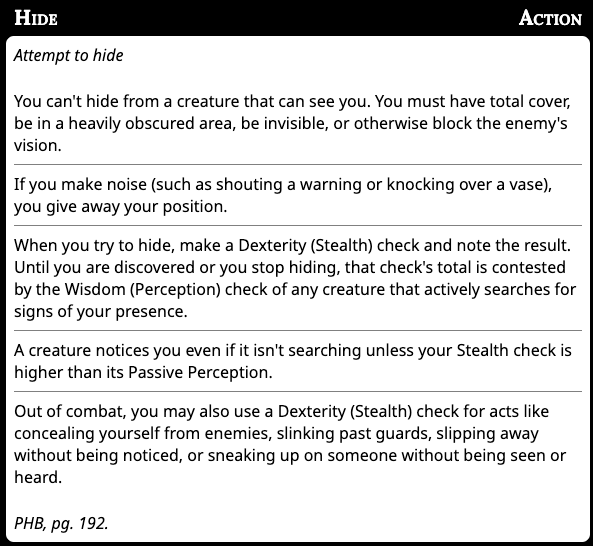

# MCDs DnD House Rules

1. A levelled spell gained through a class may only be cast with armor or shield equipped if that class provides the proficiency for that armor or shield.
	1. Taking the Heavy Armoured or Moderately Armoured feat can counteract this
1. When you use the **attack action** to make an attack using a weapon or unarmed strike, you can choose to take a -5 penalty to that attack roll. If the attack hits, you add +10 to the damage roll with a heavy weapon (d12, 2d6, d10) and +5 for a one handed (d8) weapon and +4 for a (d6) finesse like weapon.
	1. Cantrips and bonus action deliberately excluded
	1. Only for PCs
1. You can switch from a one handed weapon to another using your bonus action.
	1. This makes switching weapons less action intensive than in RAW
	2. In RAW you can stow or draw with your free action, but it then requires a use of your action to draw/stow a different weapon
1. I will use the special attacks from BG3 (e.g. Hamstring shot, Backbreaker, Brace)
1. Flanking is now a +2 bonus to hit when you outnumber the enemy at least 2-to-1 and a +5 for 3-to-1
	1. All other conditions that would grant Advantage (e.g. paralyzed) are staying the same. Only flanking is being changed to a flat bonus rather than an extra dice roll.
	1. A creature/PC can't flank when Hidden
1. [Stealth rules](stealth.md). This is all RAW, just distilled into one place, with some inferences being made.
	1. TL;DR: You must use the Hide action in order to engage in Stealth. The hide action is determined by these rules (from p177 and p192 of the PHB) 
	1. Once you are hidden your location is not known. This is true even in combat.
	1. If your location is not know you have advantage.
	1. Attacking, excessive noise and other various common sense things that are at the DMs discretion end hiding.
1. I really don't want characters to have to worry about managing inventory
	1. Will give a bag of holding and will loosely use [Variant Encumbrance](https://www.dndbeyond.com/sources/basic-rules/using-ability-scores#VariantEncumbrance)
1. You can Thunderstep with characters up to size medium, regardless of your characters size.
1. Potion actions
	1. I reaffirm the RAW that drinking a potion or feeding it to someone is an action
	3. Just like the rule above though, RAW drawing a potion from your inventory uses a free action
	2. It will also be an action to search for a potion on a character
 1. Mental ability score checks (INT, WIS, CHA) do not require an action in combat. They can only be taken on your turn and not as a reaction.
	1. e.g. You see someone cast a spell and want to identify what it might be. You can make an Arcana check, and then make an attack as normal
	1. You want to taunt your enemy. Make a Charisma check to chat shit and then cast a spell as normal.
	1. The DCs of these checks may be high however given the heat of battle.
	1. An exception to this are the Search (WIS) and Investigation (INT) actions.
1. TCOE is banned
1. Cantrip Formulas, Martial Versatility, Eldritch Versatility etc is allowed 
1. I will use the BG3 Path of the Bezerker
1. Milestone levelling
	1. Levelling will be tied to narrative objectives.

## Rationale

For 1: Casters are the most "powerful" classes in the game. When you multiclass then they also become the most armoured in the game. This is kind of broken.

For 2-4: Martial characters need more scope and more choice.

# Changelog

Removing the Shield spell ban: Taking both the shield spell and armour away from casters would render them too weak. It's also thematically appropriate that sorc/wizards can cast spells to defend themselves.

Keeping the levelled spell casting when wearing armour: this still allows multiclassing whilst taking shield and armour out of the hands of wizards etc.