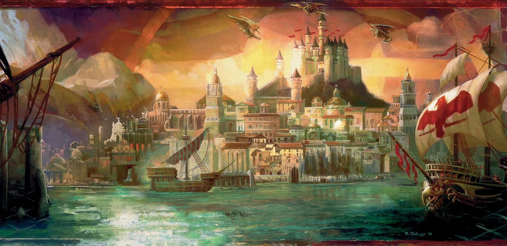
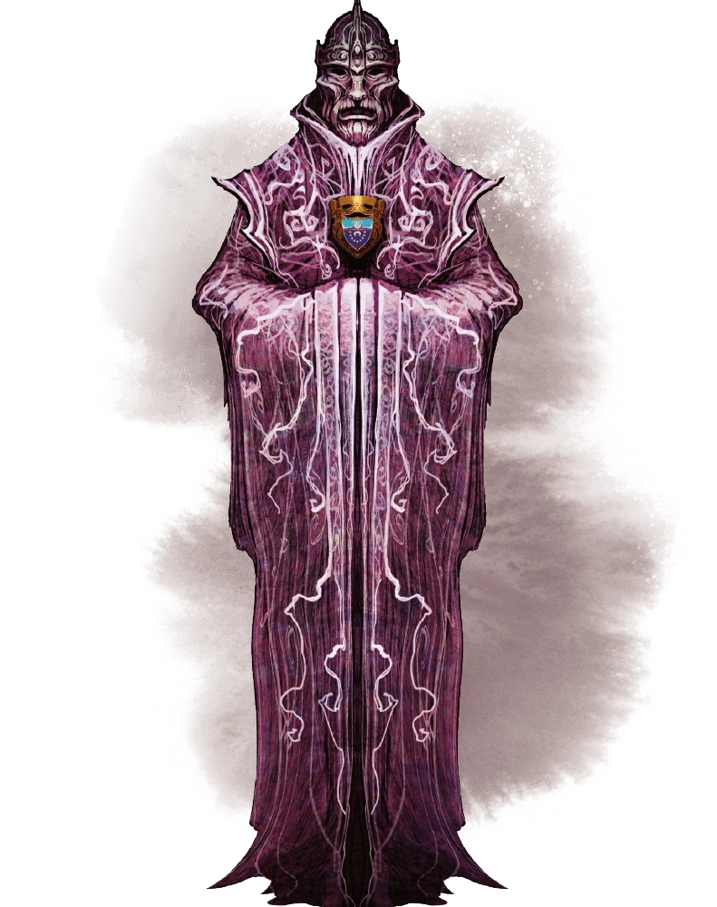

# Session 0
## Setting

The campaign is set in Waterdeep: City of Splendours; Crown of the North. Possibly the most powerful city on the Sword Coast, this metropolis draws merchants, artisans, warriors and thieves. And like vultures to a carcass such a concentration of power comes with factions competing to harness it.

The city is ruled by the council of Masked Lords and one Open Lord, drawn from all strata of Waterdhavian society. The Masked Lords hide their faces to preserve anonymity and prevent coercion. The Open Lord, nominally the most powerful, rules unconcealed as the voice and face of the council (and indeed the city itself). At least for now.

One of the Masked Lord of Waterdeep wants the Open Lord and his house utterly destroyed and is enlisting you for help (whether you like it or not). You'll have to navigate the competing interests of the Masked Lord, Xanathar, the Zhentarim, the Harpers, guild leaders and more as you try to fulfil your mission.

## House Rules

I really want to amplify the things that were fun about past campaigns whilst minimising some of the pain points.

As such I've come up with [these principles](philosophy.md) which will hoepfully implemented by these [house rules](house_rules.md).

These are not yet set in stone and are definitely up for discussion during the session.

##  Character Creation

- Start at Lvl 6
- Point buy for stats
- [Starting gold rules for items](https://www.skullsplitterdice.com/blogs/dnd/5e-starting-gold-guide)
	- 500 gp plus 1d10 × 25 gp, normal starting equipment
	- I will give each of you a magic item or two of my choosing that relates to your characters class and RP
- Feel free to bring your old characters over 
- However seeing new characters would be cool!
	- At the very least will allow a little bit of respeccing of existing characters
- Source books: PHB, DMG, MM, XGTE
	- I will consider other books but do let me know first

Obviously I'd like to see your character pre-Session 1 so we can talk about balance and RP

##  Backstory

Please provide the following (or ask Bard/ChatGPT to do it):

* **A 1st Person Intro**: Imagine I just overheard your character in a tavern, who in ~100 words gave me a rough idea about their life story and philosophy
	* e.g. <a href="https://youtu.be/nv2Nqx0r7oY?si=Gd_H9cWTAK-Mx7FE&t=34" target="_blank">the origin character intros in BG3</a>
	* e.g. Tolmar: “People speak of the gods as if they are absent from these lands. Blasphemous nonsense! Helm is as watchful as ever. My son is living proof of their divine presence. He’s got holy blood in him, that one has! But he has ventured out into the wildlands and though I trust The Vigilant One watches him, I fear for the young man's life. I was a Watcher over the Fallen I’ve seen enough wars to know that there is plenty of strife and sin to go around” 
* **A 3rd Person History**: A few bullet points that give a minor bio.
	* e.g. For Tolmar: 
		* Though zealous, Tolmar has made for a poor cleric and acolyte, much more interested in the arcane than the divine. Tolmar is blessed enough to see the portents granted by Helm (or at least that’s where he thinks who grants them). His devotion often leads him to be stubborn, abrasive and dogmatic. 
		* Repulsed by the decadence of his noble family, Tolmar joined the Church of Helm
		* Had a child with one of the holy priestesses, Sirenei
		* Avoided ex-communication by serving as a footman in some far-off war, joining the Watchers over the Fallen.
		* Has serve a quiet life until recently when his adult son ventured out into Faerun. Tolmar now searches for him, outwardly for religious vindication but more simply because he's a father worried about his son.
* **An Ideal, Bond and Flaw**: <a href="https://www.dndbeyond.com/sources/basic-rules/personality-and-background#Ideals" target="_blank">Explained here</a>
	* Example Ideals
		* Might. The strongest are meant to rule
		* Freedom. Tyrants must not be allowed to oppress the people
	* Example Bonds
		* I owe everything to my mentor--a horrible person who's probably rotting in jail somewhere.
		* I idolize a hero of the old tales and measure my deeds against that person's.
	* Example flaws
		* If my family asked me to pick between them and the skooma, I'd pick the skooma.
		* A scandal prevents me from ever going home again. That kind of trouble seems to follow me around.
	* [More examples here](https://www.enworld.org/threads/list-of-all-personality-traits-ideals-bonds-flaws.469002/)
* Why would your character be willing to go along with a plot to destroy the Open Lord. Or maybe they aren't willing, in which case, why not? Is there something forcing them to go along despite this reason (loved ones held hostage? huge reward that washes away their reluctance?)
* How is your character related to the the other PCs or NPCs? Maybe they're not? Why not?

##  Questions

* What are your boundaries/red cards? 
* For those who are a fan of RP: what were the best RP moments for you from Joes campaign or indeed any other campaign you've been a part of?
* For those who are a fan of combat: what has been a memorable combat encounter? Are there times when combat is less interesting?
* Are there things you want more of in the campaign e.g. more exploring? more problem-solving (not puzzles lol)? more mystery/intrigue/detective work?
* Do you think the campaign would be fun if there were more or less railroading?