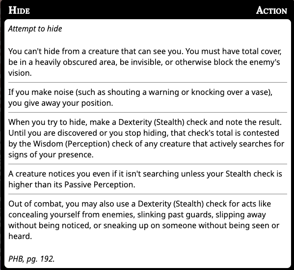

# Stealth

## Hiding

1. In order to Stealth you must take the hide action. The following rules determine this (from p177 and p192 of the PHB) 
1. When you are hidden your location is not know. This is true even in combat
1. If your location is not know:
	1. You have advantage on attacks
	1. You can't be targeted specifically. Someone can however target a square they think you might be on. 
1. Hiding ends categorically if you make excessive noise, make an attack, or choose to end the Hide action.
	1. Other than this, the things that end hiding are circumstantial and common sense things that left up to the DM. (e.g. you walk out in broad daylight, or cast a silent but albeit noticeable spell).
1. For the most part however, as long as the creature keeps line of site mostly broken, they can remain hidden and do things like the following without breaking the hiding condition:
	1. Leave from a different part of the cover they hid behind
	1. Approach an enemy from behind and stay hidden
	1. ...more player suggestions welcome!

## Invisibility

From p291 of the PHB:

> * An invisible creature is impossible to see without the aid of magic or a special sense. For the purpose of hiding, the creature is heavily obscured. The creature’s location can be detected by any noise it makes or any tracks it leaves.
> * Attack rolls against the creature have disadvantage, and the creature’s attack rolls have advantage.

1. This means unless seen an invisible creature can always attempt to Hide, since it’s always heavily obscured.
1. If a creature fails to Hide, its location is known, due to some sign other than sight such as by leaving tracks or making noise.
1. An important implication of the 2nd point: even if you can see an invisible creature (e.g. via the *See Invisibility* spell), they still have advantage on attacks and enemies have disadvantage on attacks against them by RAW. Some things (e.g. the *Faerie Fire* spell) completely removes benefit though.

## Surprise

If you are hiding when you initiate combat, you may be able to surprise the enemy.

> If neither side tries to be stealthy, they automatically notice each other. Otherwise, the DM compares the Dexterity (Stealth) checks of anyone hiding with the passive Wisdom (Perception) score of each creature on the opposing side. Any character or monster that doesn’t notice a threat is surprised at the start of the encounter.

This means that a creature must not notice any threats at the start of the encounter to be suprised. If they detects at least one of the party trying to hide, they are not suprised by any member. Everyone in the group must roll higher Stealth than that enemy’s passive Perception to surprise.

## Further Reading

I used [this write-up](https://tabletopbuilds.com/hiding-surprise-and-more/) and [this FAQ](https://www.enworld.org/threads/how-does-stealth-work-in-d-d-5e.681156/) as the basis for this doc. 